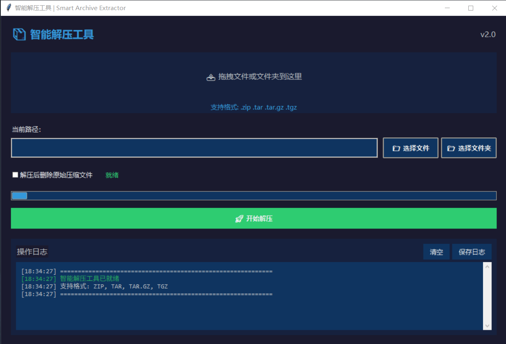

# 📦 智能解压工具 | Smart Archive Extractor

一款功能强大、界面美观的智能递归解压工具，支持多种压缩格式，具备拖拽操作和批量处理能力。


## ✨ 功能特性

### 📁 支持格式
- **ZIP** (.zip)
- **TAR** (.tar)
- **GZIP压缩** (.tar.gz, .tgz)

### 🔧 核心功能
- ✅ **智能递归解压**：自动检测并解压嵌套的压缩文件
- ✅ **中文文件名支持**：完美处理中文编码的ZIP文件
- ✅ **保持文件时间**：解压后保留原始文件修改时间
- ✅ **批量处理**：支持文件夹批量解压
- ✅ **进度显示**：实时显示解压进度和状态

### 🎨 用户界面
- 🌙 **现代深色主题**：护眼设计，专业美观
- 🖱️ **拖拽操作**：支持文件/文件夹拖拽到窗口
- 📊 **彩色日志**：不同状态使用不同颜色标识
- 🔄 **实时状态**：显示当前操作状态和进度
- 📝 **日志管理**：支持清空、保存操作日志

### ⚙️ 高级选项
- 🗑️ **自动清理**：可选解压后删除原始压缩包
- 📂 **智能整理**：自动创建对应文件夹存放解压内容
- ⚡ **后台处理**：解压过程不阻塞界面操作

## 🚀 快速开始

### 安装方式

#### 方法一：直接下载EXE（推荐）
1. 从 [地址未更新](地址未更新) 下载最新版 `智能解压工具.exe`
2. 双击即可运行，无需安装Python环境

#### 方法二：源码运行
```bash
# 1. 克隆项目
git clone https://github.com/yourusername/smart-extractor.git
cd smart-extractor

# 2. 安装依赖
pip install -r requirements.txt

# 3. 运行程序
python smart_extractor.py
```

#### 方法三：PyInstaller打包
```bash
# 打包为单个EXE文件
pyinstaller -F -w -i icon.ico smart_extractor.py

# 打包为文件夹（启动更快）
pyinstaller -w -i icon.ico smart_extractor.py
```

### 系统要求
- **操作系统**: Windows 7/8/10/11, macOS 10.12+, Linux
- **内存**: 至少 512MB RAM
- **磁盘空间**: 50MB 可用空间
- **Python版本**: 3.7 或更高（仅限源码运行）

## 📖 使用指南

### 基本使用
1. **选择文件/文件夹**
   - 点击"选择文件"按钮选择单个压缩文件
   - 点击"选择文件夹"按钮选择包含压缩文件的文件夹
   - 直接拖拽文件或文件夹到窗口区域

2. **设置选项**
   - 勾选"解压后删除原始压缩文件"可自动清理
   - 此选项谨慎使用，建议先测试确认

3. **开始解压**
   - 点击"🚀 开始解压"按钮
   - 程序将自动递归解压所有支持的压缩文件
   - 可在日志区域查看实时进度

### 使用技巧
- **批量解压**：选择一个包含多个压缩文件的文件夹
- **嵌套解压**：程序会自动解压压缩包内的压缩文件
- **日志查看**：所有操作都有详细日志记录
- **错误处理**：遇到错误会自动跳过并记录原因

### 注意事项
⚠️ **重要提示**
- 解压大文件时请确保有足够磁盘空间
- "删除原始文件"选项不可逆，请谨慎使用
- 建议先解压测试，确认无误后再使用删除功能

## 🛠️ 开发指南


### 依赖安装
```bash
# 基础依赖
pip install pillow

# 可选依赖（拖拽功能）
pip install tkinterdnd2

# 开发依赖（打包）
pip install pyinstaller
```

### 自定义开发
1. **修改主题颜色**
   在 `ModernApp` 类的 `__init__` 方法中修改 `self.colors` 字典

2. **添加新格式支持**
   修改 `SUPPORTED_EXTS` 元组，并添加对应的解压函数

3. **调整界面布局**
   修改 `create_widgets` 方法中的组件布局

## 📦 打包发布

### 生成EXE文件
```bash
# 简单打包
pyinstaller -F -w -i icon.ico smart_extractor.py

# 完整打包（包含所有依赖）
pyinstaller --onefile --windowed \
    --hidden-import=tkinterdnd2 \
    --hidden-import=PIL \
    --icon=icon.ico \
    --name="智能解压工具" \
    smart_extractor.py
```

### 打包配置文件
```python
# build.spec 示例
a = Analysis(
    ['smart_extractor.py'],
    hiddenimports=['tkinterdnd2', 'PIL', 'PIL._imaging'],
    excludes=['pathlib'],
    ...
)
```

## 🔍 技术细节

### 解压算法
```python
# 递归解压流程
1. 遍历目录下所有文件
2. 检测是否为支持的压缩格式
3. 解压到同名文件夹
4. 递归检查解压出的文件
5. 重复直到没有可解压文件
```

### 编码处理
- **ZIP文件**：自动检测并转换中文编码（CP437 → GBK）
- **TAR文件**：使用系统默认编码
- **文件名**：保留原始文件的完整路径结构

### 错误处理
- ✅ 文件损坏：跳过并记录错误
- ✅ 权限不足：提示用户并继续
- ✅ 磁盘空间不足：提前检测并警告
- ✅ 重复文件：自动跳过已存在的文件

## ❓ 常见问题

### Q: 程序无法启动？
**A**: 
1. 确保系统已安装 [Microsoft Visual C++ Redistributable](https://aka.ms/vs/17/release/vc_redist.x64.exe)
2. 以管理员身份运行
3. 检查杀毒软件是否误报

### Q: 拖拽功能不可用？
**A**: 
1. 安装 tkinterdnd2: `pip install tkinterdnd2`
2. 重新启动程序
3. 确保操作系统支持拖拽

### Q: 解压中文文件名乱码？
**A**:
1. 程序已内置中文编码自动检测
2. 对于特殊编码，可手动指定编码方式
3. 确保系统区域设置为中文

### Q: 程序占用内存过高？
**A**:
1. 解压大文件时会有临时内存占用
2. 程序会自动清理临时文件
3. 可关闭其他程序释放内存

## 🤝 贡献指南

欢迎提交 Issue 和 Pull Request！

1. **报告问题**
   - 描述清晰的问题现象
   - 提供复现步骤
   - 附上错误日志

2. **提交代码**
   - 遵循现有代码风格
   - 添加必要的注释
   - 更新相关文档

3. **功能建议**
   - 说明使用场景
   - 提供参考实现
   - 讨论技术可行性

## 📄 许可证

本项目采用 MIT 许可证 - 查看 [LICENSE](LICENSE) 文件了解详情。

## 📞 联系支持

- **GitHub Issues**: [提交问题](https://github.com/yyhbird/recur_unzip_tool/issues)
- **邮箱**: 1145594228@qq.com

## 🎯 更新日志

### v2.0 (2026.01.02)
- ✅ 全新现代深色主题界面
- ✅ 拖拽文件/文件夹支持
- ✅ 彩色日志系统和时间戳
- ✅ 进度条和实时状态显示
- ✅ 日志保存和清空功能
- ✅ 优化递归解压算法
---

⭐ **如果这个工具对你有帮助，请给个 Star！** ⭐

**温馨提示**: 使用本工具解压重要文件前，建议先备份原始文件。